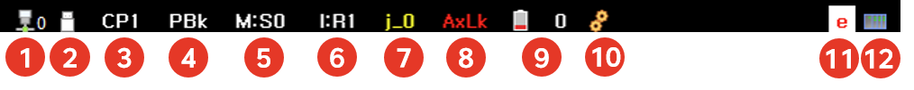

# 1.2.3.1 제목 표시줄

TP 화면의 최상단에 로봇 시스템의 상태를 표시합니다.

 

| 번호 | 설명 | 
| :--- | :--- | 
|  | 네트워크 상태를 표시합니다. ( : 연결O,  : 연결X)|
|  | usb 메모리가 삽입된 경우 해당 아이콘으로 표시됩니다. |
|  | 연속패스(CONTPATH) 모드를 표시합니다. (CP# : CP(연속패스)+모드번호)   (참고: [R360](../../../8-r-code/15-r360.md?cont_model=${cont_model})) |
|  | 응용 기능별 현재 상태를 표시합니다.(SW : 건서치 기록 상태, PBk : 도장 구간) |
|  | 포지셔너 동기 상태를 표시합니다.(M:S{스테이션번호}) |
|  | 협조제어 상태를 표시합니다.(I:독립, M:마스터 지정, S:슬레이브 지정) |
|  | 축 제어 상태를 표시합니다.(j_{축번호} off인 경우 표시) |
|  | 축 잠금 상태를 표시합니다.|
|  | 엔코더 배터리 이상 상태를 표시합니다. (이상 상태인 경우 점멸)|
|  | 감속기 수명 이상 상태를 표시합니다.(이상 상태인 경우 축 번호 표시 및 점멸)|
|  | 사용자 레벨을 표시합니다. (E : 엔지니어모드)   (참고: [R314](../../../8-r-code/12-r314.md?cont_model=${cont_model}))|
|  | PLC 동작 상태를 표시합니다. |