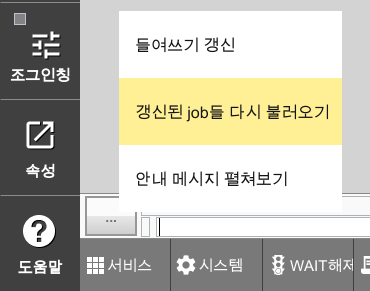
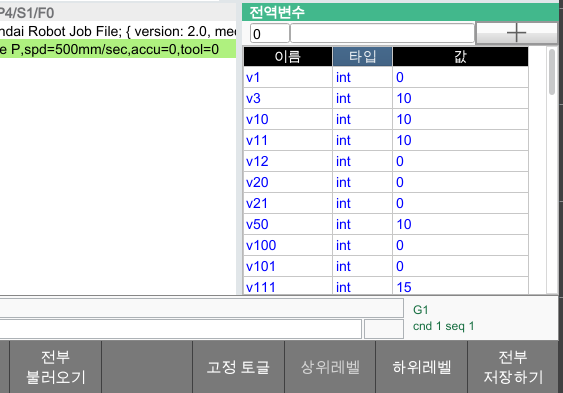

# 11.1.1 project/ 폴더의 FTP 로드시 주의할 점


\[주의\] 파일관리자, 혹은 FTP 서비스를 통해, 폴더와 파일을 수정할 수 있습니다.  
하지만, 파일을 함부로 수정하거나 삭제할 경우, 부팅 불능, 오동작, 데이터 유실 등 심각한 문제가 발생할 수 있습니다. 내용을 완전히 숙지하고 있거나, 전문가의 도움을 받는 경우가 아니면 함부로 조작하지 않도록 유의하십시오.


HRWorkbench나 파일관리자, 백업 기능을 통해 프로젝트 폴더의 설정, 교시 파일의 백업, 복원이 가능합니다.

하지만, 때로는 익숙한 FTP 소프트웨어를 사용하여 PC로의 파일 백업과 로봇 제어기로의 복원을 수행하는 것이 편리할 때도 있습니다.
이 때, 주의해야 할 점을 설명하겠습니다. (프로젝트 폴더의 각 파일에 대해서는 다음 절에서 설명합니다.)

## project/jobs/ 폴더 내의 .job 파일 변경 후 반영

FTP 소프트웨어로 .job 파일을 `project/job/` 폴더에 추가, 혹은 덮어쓰기한 경우, 로봇제어기는 이를 즉각 메모리에 반영하지 않습니다. (HRWorkbench나 파일관리자의 경우는 즉각 인식하여 자동으로 메모리로 로드합니다.)

이를 메모리에 반영하기 위한 방법은 아래 2가지가 있습니다.

- HOME 하면 콘솔 막대의 `...` 버튼을 클릭하여 `갱신된 job들 다시 불러오기`를 수행

  

- 로봇제어기를 재부팅

## project/vars/ 폴더 내의 .json, .csv 파일 변경 후 반영

FTP 소프트웨어로 전역 변수 파일을 `project/vars/` 폴더에 추가, 혹은 덮어쓰기한 경우, 로봇제어기는 이를 즉각 메모리에 반영하지 않습니다. (HRWorkbench나 파일관리자의 경우는 즉각 인식하여 자동으로 메모리로 로드합니다.)

이를 메모리에 반영하기 위해서는 아래 방법을 사용하십시오.

- 전역변수 모니터링 창을 열어 선택한 후, 하단의 `전부 불러오기` F버튼을 클릭하십시오.

  


전역 변수 파일을 덮어 씌운 후 이를 인식시키기 위해 로봇제어기를 재부팅하는 방법은 사용하지 마십시오. 로봇제어기를 전원OFF 시키는 순간, 메모리의 전역 변수값을 파일로 저장하기 때문에, 다시 기존의 변수들로 덮어 씌워집니다.

