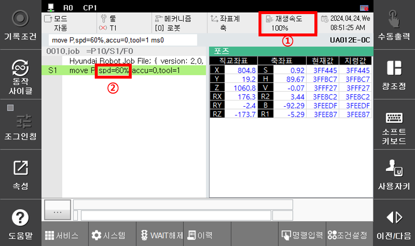
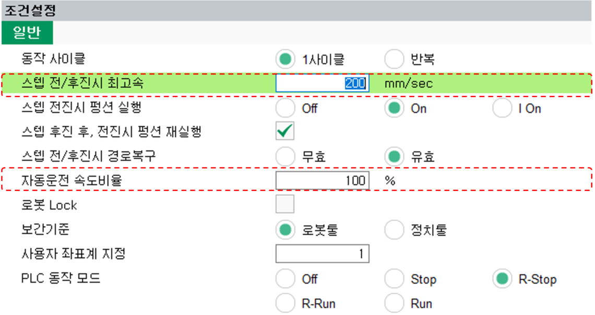

# 2.2.2 운전 속도 조정

자동 운전 시에는 ${cont_model} 티치 펜던트 화면 상단의 상태 표시줄에 프로그램 재생 시 로봇의 재생 속도\(%\)가 표시됩니다. 표시된 재생 속도는 스텝에 기록되어 있는 스텝 속도에 대한 로봇의 이동 속도의 비율입니다.

| No. | 항목 | 모드 | 설명 |
|-----|-----|-----|-----|
| ① | 재생 속도 | Auto | 스텝 속도에 대한 로봇의 이동 속도의 비율 (1 - 100) |
| ② | 스텝 속도 | Auto/Manual | 해당 스텝의 지령 속도 (단위: mm/sec, cm/min, %, sec) |
| ③ | 이동 속도 | Auto/Manual | 재생 속도 \(%\) * 스텝 속도 |

재생 속도를 조작하는 방법은 다음과 같습니다.

1. 자동 모드에서 `[CTRL]`+`[SPEED.HI]` 또는 `[CTRL]`+`[SPEED.LOW]` 키로 재생 속도 조절합니다.  
재생 속도가 10 미만인 경우 1 단위로 증감합니다.  
재생 속도가 10 이상인 경우 10 단위로 증감합니다.

2. 자동 모드에서 재생 속도 표시 영역을 터치하면 속도 조절 다이얼로그가 팝업됩니다.  
재생 속도를 1 - 100 범위로 숫자를 입력 하거나 슬라이드 바를 조작하여 최소 단위 1% 로 값을 조정할 수 있습니다.  
다이얼로그의 확인 버튼을 누르면 입력한 값으로 재생 속도가 변경됩니다.


\[주의\] 모션 중 실시간 재생 속도 조절을 반영하는 동작 사양은 다음과 같습니다.
* 일반적으로 모션 동작 중에 재생 속도를 조절하면 실시간으로 현재 모션에 반영됩니다.
* 단, SAFETY MODE 에서는 현재 모션 종료 후, 다음 스텝부터 변경된 재생 속도를 반영합니다.
* 또한, 아크 기능이 활성화된 상태에서는 모션 중 실시간 재생 속도 변경을 반영하지 않습니다.
* 재생 속도 값을 1 -> 100 또는 100 -> 1 등의 큰 값의 변경은 권장하지 않습니다.



수동 모드일 때, 상태 표시줄의 `속도조절` 버튼에는 재생 속도\(%\) 대신 스텝 제한 속도\(mm/sec\)가 표시됩니다.


자동 모드에서는 조건 설정의 자동 운전 속도 비율 값을 변경하여 프로그램을 수정하지 않고 로봇의 운전 속도를 조절할 수 있습니다.

${cont_model} 티치 펜던트 화면 우 하단에서 `조건설정` 버튼을 터치한 후 설정창에서 \[2: 스텝 전후진시 최고속\] 과 \[6: 자동운전 속도비율\] 옵션의 값을 설정하십시오.

 

