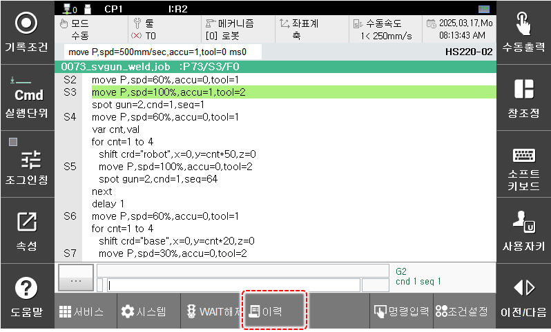
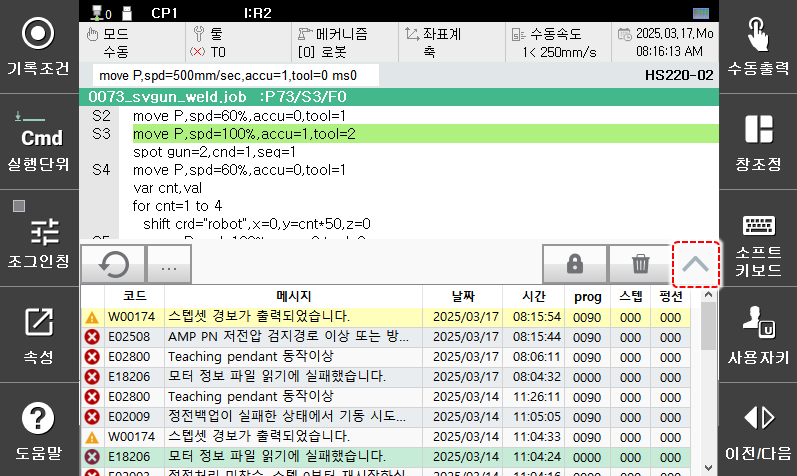
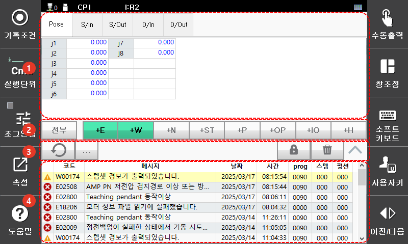
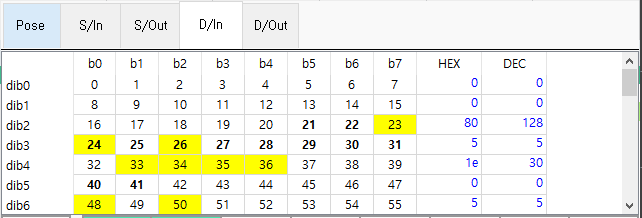

# 2.6 이벤트 이력 (event log)

과거로부터 현재 시점에서 발생한 일정 개수의 에러, 경고, 알림, 시작/정지, 조작, I/O 값의 변화, 로봇언어 실행 등 이벤트의 이력이 보관됩니다. (보관되는 최대 개수는 타입에 따라 다릅니다.) 
각 이력의 타입과 메시지, 발생 시각, 발생 시점의 프로그램/스텝/펑션 번호와 관련 보조정보를 확인할 수 있으며, 이를 문제 원인의 분석과 대응에 단서로 활용할 수 있습니다.

패널 선택창에서 하단의 \[이력\]을 터치하십시오. 이력창이 나타납니다.
           

각종 이벤트 이력을 확인할 수 있습니다. 오른쪽 위방향 화살표를 터치하십시오.

아래 그림과 같이 이력에 대한 필터 옵션과 보조정보들이 표시됩니다. 한번 더 누르면 닫을 수 있습니다.


보조정보의 표시는 V60.30-01부터 지원됩니다.


<table>
  <thead>
    <tr>
      <th style="text-align:left">번호</th>
      <th style="text-align:left">설명</th>
    </tr>
  </thead>
  <tbody>
    <tr>
      <td style="text-align:left">
        
      </td>
      <td style="text-align:left">
        보조정보 : 에러와 경고는 발생한 시점의 시스템의 상태가 같이 기록되며, 보조정보 창에서 이를 확인할 수 있습니다. 상단의 탭을 클릭하여 원하는 보조정보를 선택해 확인할 수 있습니다. 켜진 입출력 신호값은 노란바탕으로 표시되며, 할당된 사용자 입출력이면 볼드체로 표시됩니다.
        <ul>  
          <li>Pose : 로봇, 부가 축 값입니다. (단위: mm 혹은 deg.)</li>
          <li>S/In : 시스템입력(전용입력)신호의 값입니다. 첫 8byte만 기록됩니다. (sib0~7)</li>
          <li>S/Out : 시스템출력(전용출력)신호의 값입니다. 첫 8byte만 기록됩니다. (sob0~7)</li>
          <li>D/In : 사용자입력(범용입력)신호의 값입니다. fb0의 첫 32byte만 기록됩니다. </li>(fb0.dib0~31)
          <li>D/Out : 사용자출력(범용출력)신호의 값입니다. fb0의 첫 32byte만 기록됩니다. </li>(fb0.dob0~31)
        </ul>
      </td>
    </tr>
    <tr>
      <td style="text-align:left">
        
      </td>
      <td style="text-align:left">
        필터 버튼으로 원하는 타입의 이력만 표시할 수 있습니다. 필터 버튼을 켜면 해당 타입을 표시하고, 끄면 감춥니다.
        <ul>
          <li>[전부]: 모든 필터버튼을 한꺼번에 끄거나 켭니다.</li>
          <li>[+E]/[+W]: 에러 또는 경고 이력을 확인합니다.</li>
          <li>[+N]: 알림(Notice) 이력을 확인합니다.</li>
          <li>[+ST]: 로봇의 기동(START)과 정지(STOP) 이력을 확인합니다.
          <li>[+P]: 주기적으로 기록되는 상태 이력을 확인합니다.</li>
          <li>[+OP]: 사용자 조작 이력을 확인합니다.</li>
          <li>[+IO]: 입출력 신호의 변화 이력을 확인합니다.</li>
          <li>[+H]: JOB 프로그램의 실행 이력을 확인합니다.</li>
        </ul>
      </td>
    </tr>
    <tr>
      <td style="text-align:left">
        
      </td>
      <td style="text-align:left">
        <ul>
          <li>[]: 팝업 메뉴를 엽니다.
            <ul>
              <li>log 파일로 저장: 이벤트들은 먼저 메모리 버퍼에 저장되고 버퍼가 차면 자동으로 파일로 저장됩니다. 이 메뉴를 선택하면 아직 버퍼에 있는 이력들도 즉시 파일로 저장합니다.</li>
              <li>log 파일 클리어: 메모리 버퍼의 이력을 클리어하고 이력 파일을 모두 삭제합니다.(삭제된 파일은 복구할 수 없습니다.)</li>
            </ul>
          </li>
          <li>[
            ]: 새로운 이력이 화면에 표시되는 것을 잠급니다. 잠그더라도 새로 발생하는 이력은 계속 기록되며, 화면 갱신만을 막는 것입니다. 이력 화면에 계속 갱신되어, 확인이 방해될 때 활용할 수 있는 기능입니다.잠금 버튼을 한번 더 누르거나, 이력창을 닫았다가 열어서 잠금을 풀 수 있습니다.</li>
          <li>[
            ]: 화면에 표시된 이력을 클리어합니다. 화면만 클리어하는 것이고, 내부적으로 기록된 이력은 삭제되지 않습니다.</li>
          <li>[
            ]: 이력 화면을 클리어한 상태에서 이 버튼을 누르면, 이력을 다시 가져와 화면에 표시합니다.</li>
        </ul>
      </td>
    </tr>
    <tr>
      <td style="text-align:left">
        
      </td>
      <td style="text-align:left">선택한 타입의 이력 목록입니다. 새로 발생한 이벤트는 상단에 노란 바탕색으로 표시됩니다.</td>
    </tr>
  </tbody>
</table>

