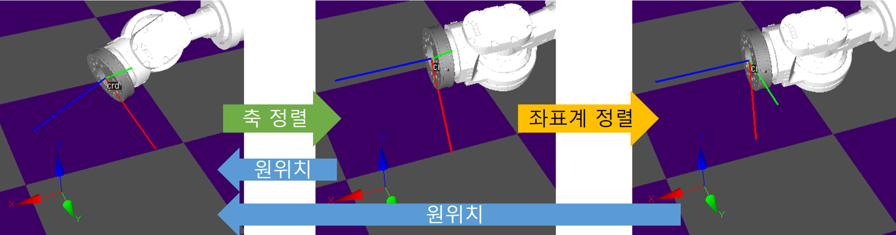
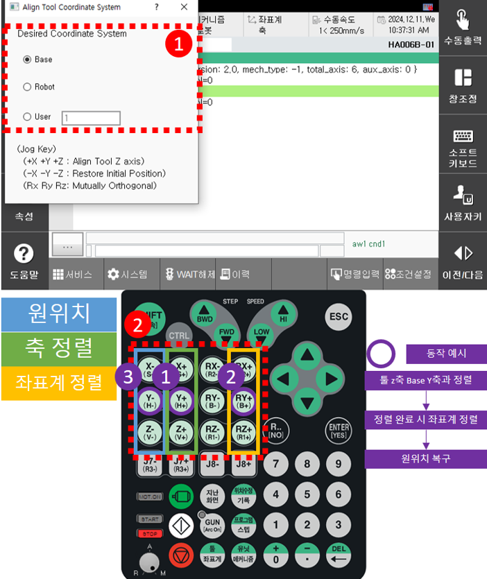

# 2.8.6 좌표축 정렬

XYZ 위치는 고정한 상태로 설정한 좌표계의 축으로 TCP 좌표계를 정렬하는 기능입니다.

해당 기능은 2단계로 나눠서 정렬합니다. 
* 축 정렬(1단계) : 해당 단계에서는 툴의 z축을 선택한 좌표계로 정렬합니다.
* 좌표계 정렬(2단계) : 축 정렬(1단계)이 완료된 상태에서 TCP 좌표계와 선택한 좌표계가 서로 직교하도록 정렬합니다.
* 원위치 복구 : 해당 기능 진입할 때의 초기 위치로 이동합니다. 정렬 단계의 완료 여부와 상관없이 윈위치로 복구합니다. 

좌표축 정렬하는 방법은 다음과 같습니다.

1.	목적에 맞는 위치로 조깅이 끝난 상태에서 현재 로봇이 정지해있고 모터 On 그리고 수동모드인지 확인하십시오.

2.	티치펜던트의 <**Ctrl**> 버튼 키와 화면의 `[좌표계]`를 함께 누르거나, R300으로 좌표축 정렬 화면에 진입하십시오.

3.	이동하고자 하는 좌표계를 선택하십시오.

4.  원하는 축 방향으로 조그 키를 눌러 툴의 z축을 정렬하십시오. (1단계)

5.  축 정렬(1단계)이 완료된 상태에서 선택했던 키의 회전방향 키를 선택하여 좌표계 정렬하십시오. (2단계 - 선택 사항)

6.  원하는 위치에 도달했으면 좌표축 정렬 화면을 ESC 키로 종료하십시오.

조그 키 기능 정리
  - 축 정렬 : +X, +Y, +Z 키
  - 원위치 복구 : -X, -Y, -Z 키
  - 좌표계 정렬 : 툴의 z축 정렬 시 선택한 키의 회전 방향(+Rx, +Ry, +Rz) 키 
     


* 좌표축 정렬 기능 창이 활성화 된 상태일 때는 조그 기능이 비활성화 된다.
* 좌표계 정렬 기능은 축 정렬이 완료 되었을때만 동작한다.
* 툴의 z축 정렬이 완료되면 조그버튼을 눌러도 해당위치에 있다.
* 소프트리밋을 피해갈 수 있는 방향으로 정렬을 진행하지만 그 어느 방향으로도 피할 수 없으면 소프트리밋 초과 에러 로그가 띄워진다.
  (예상되는 정렬 경로가 시계방향인데 소프트리밋이 발생하는 동작이면 시계반대방향으로 회전한다.)
* 베이스, 로봇, 사용자 좌표계 선택 후 조그하면 해당 좌표계로 기준이 변경된다.



* 반드시 로봇이 정지된 상태에서 수행해야하고 수동 모드일 때만 해당 기능을 실행하십시오. (자동모드에서는 실행 불가)
* 정렬을 위해 조그 키를 누르는 도중 ESC 키를 눌러 팝업 창을 종료하면 조그가 다시 활성화되니 이에 유의하여 작업하십시오.
* 부가축이 베이스이고 X,Y,Z가 지정되지 않은 **임의** 상태이면 에러 로그가 띄워집니다.
* 조그로도 이동할 수 없는 정렬 방향이면 도달할 수 없는 XYZ 위치입니다 에러 로그가 띄워집니다.
* 보간 불가능 자세에서 정렬을 다시 진행하면 에러가 나오는데 이때 원위치 복구키를 눌러 해당 구간을 회피하여 다시 구동하십시오.
* 특이점 발생 지점에서 정렬 할 때, 뗀 버튼을 다시 누르면 마저 이동하지만 현위치에서 경로를 재연산하므로 정상 속도로 동작합니다. (속도가 조금 빨라지는데 해당 속도가 정상적인 속도)

