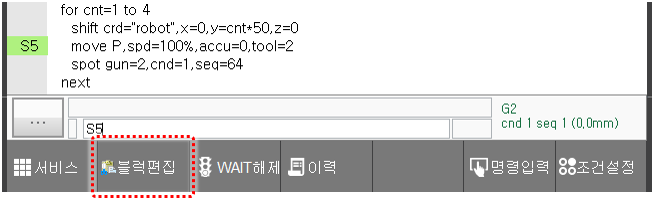
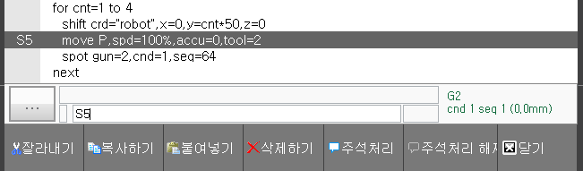
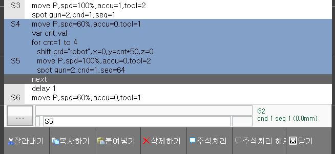
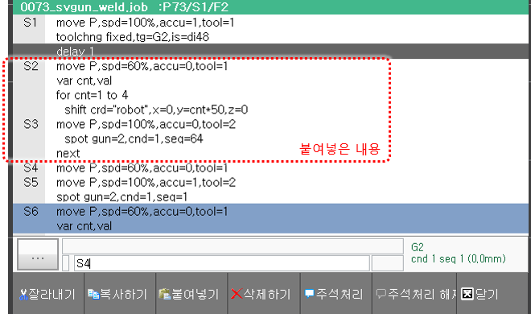
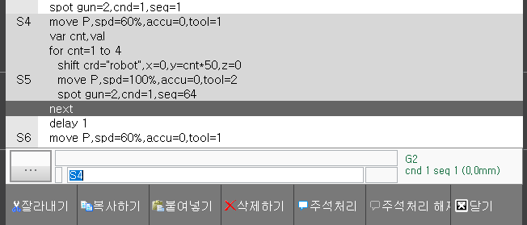
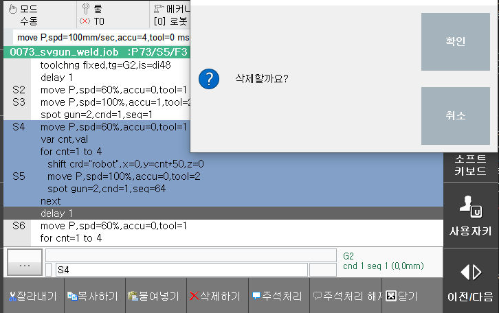
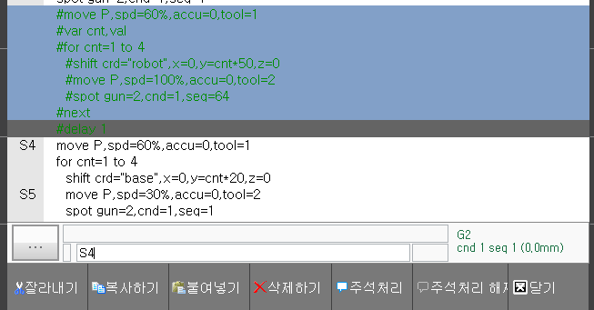
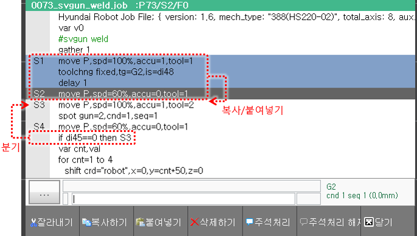
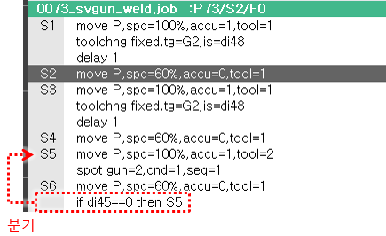
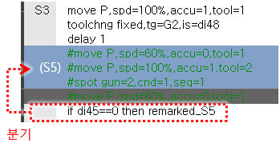

# 3.2.4.5 블록 편집 모드

프로그램의 한 행 또는 여러 행을 블록\(Block\)으로 설정하여 복사, 이동, 삭제 및 주석처리를 수행할 수 있습니다.
 

#### 1.	블록 편집 모드로 진입하기.

job 편집 화면에서 화살표 좌 키로 커서를 주소영역으로 옮깁니다.  
`F2: 블록편집` 버튼을 클릭하면 블록 편집 모드로 진입하면서, 커서가 회색으로 바뀝니다.

  

#### 2. 블록 설정하기

화살표 상/하 키로 커서를 움직여 블록 시작 위치에 두고 `ENTER`키를 누릅니다. 다시 화살표 상/하 키로 커서를 움직여 블록 끝 위치에 두고 `ENTER`키를 누릅니다. 편집을 수행할 블록이 파란 배경색으로 설정되었습니다.

(커서를 블록에서 다른 곳으로 이동시키지 않고, 그 자리에서 복사나 삭제 등을 한다면, 두 번째 `ENTER`는 누르지 않아도 됩니다.)
  

#### 3. 복사하기

블록이 설정된 상태에서 `F2: 복사하기`를 클릭하면 블록의 내용이 클립보드로 복사됩니다.  
혹은, 블록설정 없이 `F2: 복사하기`를 클릭하여 1행만 복사할 수도 있습니다.
  

#### 4. 붙여넣기

화살표 상/하 키로 커서를 움직여 붙여넣을 지점의 바로 윗 행에 커서를 두고 `F3: 붙여넣기`를 클릭합니다.  
예를 들어, 아까 클립보드로 복사한 블록의 S1의 `delay 1` 명령문 아래에 붙여넣는다면 커서를 `delay 1`에 두고 `F3: 붙여넣기`를 클릭하면 됩니다.

  

#### 5. 잘라내기

블록이 설정된 상태에서 `F1: 잘라내기`를 클릭하면 블록이 옅은 회색으로 변하면서 잘라낸 상태로 표현됩니다.  
혹은, 블록설정 없이 `F1: 잘라내기`를 클릭하여 1행만 잘라낼 수도 있습니다.

잘라낸 블록의 붙여넣기는 위에서 설명한 방법과 동일합니다.
  

#### 6. 삭제하기

블록이 설정된 상태에서 `F4: 삭제하기`를 클릭한 후, `삭제할까요?` 메시지에 `[확인]`을 클릭하면 블록이 삭제됩니다.  
혹은, 블록설정 없이 `F4: 삭제하기`를 클릭하여 1행만 삭제할 수도 있습니다.
 
  

#### 7. 주석처리, 주석처리 해제

job 프로그램의 특정 영역을 삭제하지는 않으면서 임시로 실행이 안 되도록 할 때, 사용하는 기능입니다.  
블록이 설정된 상태에서 `F5: 주석처리`를 클릭하면, 블록 내의 명령문들이 주석처리(remark)됩니다.  
블록이 설정된 상태에서 `F6: 주석처리 해제`를 클릭하면, 주석을 해제(unremark)됩니다.  
혹은, 블록설정 없이 1행에 대한 주석 처리와 해제를 할 수도 있습니다.


- 버전 V60.30-00 미만 : 스텝은 주석처리되지 않습니다.
- 버전 V60.30-00 이상 : 스텝도 주석처리됩니다.


 
  

#### 8. 블록 편집 모드 종료하기

`F7: 닫기`를 클릭하거나, `ESC` 키를 누르면 블록 편집 모드가 종료됩니다.
  

#### 9. 스텝번호 자동 조정

가령 아래 그림과 같이 S1~S2를 복사하여 하단에 붙여넣는다고 하면, S3의 `move`문은 붙여넣은 2개의 스텝에 의해 번호가 밀려서 S5로 바뀌게 됩니다.

이 때, 동일 job 내의 모든 분기 명령문(`goto`, `gosub`, `if`문, `wait`문의 timeout 주소 등)의 타겟 주소 S3은 S5로 자동 조정됩니다. 

예를 들어 아래 그림의 조건부 분기 명령문인 `if di45==0 then S3`은 전과 동일한 `move`문으로 분기하기 위해 타겟 주소인 S3이 S5로 자동 조정됩니다.

이러한 스텝번호 자동 조정은 기록, 삭제, 블록편집 등 스텝 번호가 밀리거나 당겨지는 동작들에 대해 수행됩니다.


아래 사양은 버전 V60.30-00 이상부터 적용됩니다;


타겟이 되는 스텝이 삭제나 주석 처리에 의해 사라지는 경우에는 아래와 같이 `deleted_스텝번호` 혹은 `remarked_스텝번호`로 조정됩니다. 이렇게 조정된 타겟 주소는 적절한 스텝 번호 (혹은 행번호나 레이블)로 수작업 조정해주십시오.
(그대로 두면, 명령문 실행 시 문법 에러가 발생합니다.)

