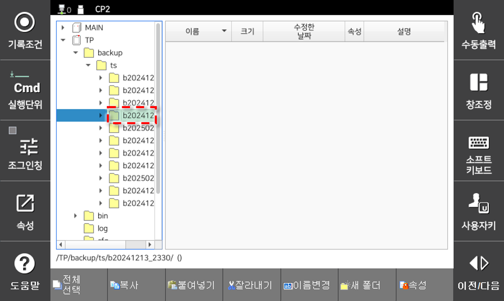
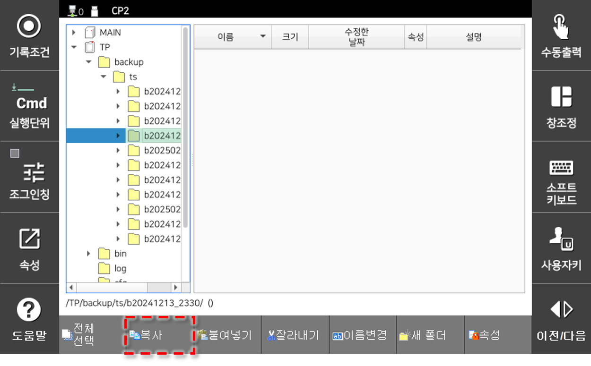
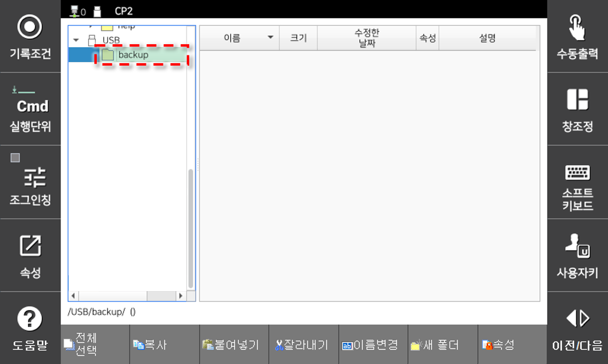
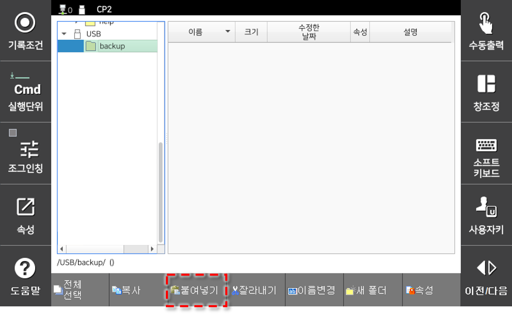
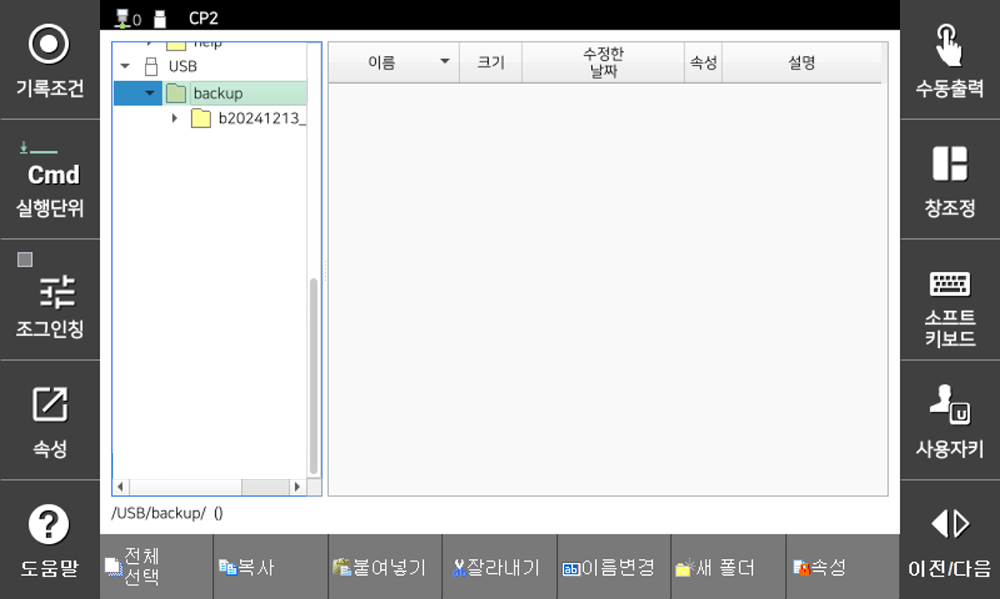

# 4.2.9 자동 백업 가져오기

시스템 - 자동 백업 및 복원에서 설정한 자동 백업을 가져온다.

1. 파일관리자 화면에서 \(T/P\) 항목 밑의 backup/ts 에서 티치 펜던트의 방향키를 이용해 가져올 백업 폴더를 선택하십시오.

2. `복사` 버튼 클릭해 백업을 복사하십시오. 백업\(약 3분 소요\)

3. 폴더 목록의 이동식 저장 장치(USB)에서 티치 펜던트의 방향키를 이용해 백업을 저장할 대상 폴더를 선택하십시오.

4. `붙여넣기` 버튼 클릭해 백업을 저장 장치(USB)로 가져오십시오.

5. 완료되면 파일관리자 화면에서 확인하십시오.

