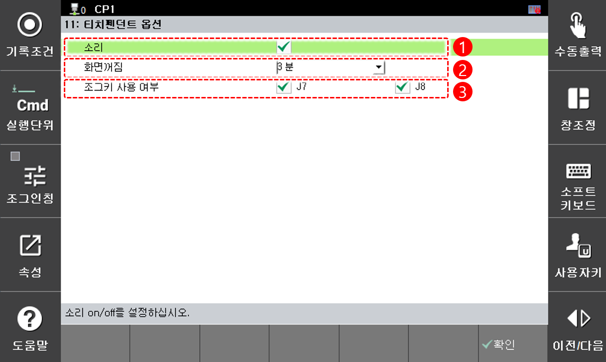

# 4.7 티치펜던트 옵션

티치펜던트 동작 관련 옵션을 설정합니다.

<table>
  <thead>
    <tr>
      <th style="text-align:left">번호</th>
      <th style="text-align:left">설명</th>
    </tr>
  </thead>
  <tbody>
    <tr>
      <td style="text-align:left">
        
      </td>
      <td style="text-align:left">티치 펜던트의 소리 발생 여부를 선택합니다.</td>
    </tr>
    <tr>
      <td style="text-align:left">
        
      </td>
      <td style="text-align:left">티치펜던트의 화면이 꺼지는 시간을 선택합니다.</td>
    </tr>
    <tr>
      <td style="text-align:left">
        
      </td>
      <td style="text-align:left">조그키 <b>J7-/J7+</b>과 <b>J8-/J8+</b>를 사용할 지 각각 선택합니다.  조그키 오조작으로 인한 포지셔너 충돌 등이 우려될 경우 이 옵션을 끄십시오.</td>
    </tr>
  </tbody>
</table>


조그키 사용 여부에 자세한 관한 내용은  "[7.6.6 메커니즘 설정](../7-system/6-initialization/6-mechannism-set.md)"의 메커니즘 조그 규칙을 참고하십시오.


