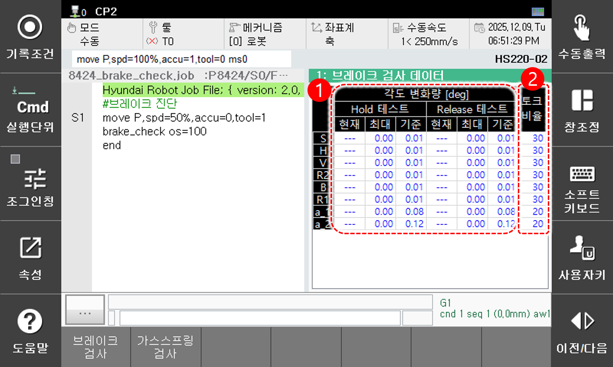

# 6.4.2.1 브레이크 검사 모니터링

아래 버튼에서 **[브레이크 검사]** 를 터치하면 브레이크 검사 데이터 창이 나타납니다.

<table>
  <thead>
    <tr>
      <th style="text-align:left">번호</th>
      <th style="text-align:left">설명</th>
    </tr>
  </thead>
  <tbody>
    <tr>
      <td style="text-align:left">
        
      </td>
      <td style="text-align:left">
        <strong>[각도 변화량]</strong>
        
브레이크 Hold/Release 상태에서 토크 적용 시 현재 각도 변화량, 최대 각도 변화량, 기준 각도 변화량을 표시합니다.

        <ul>
          <li>현재 각도 변화량은 검사 중인 축에만 표시됩니다.</li>
          <li>기준값 설정 모드인 경우 축 이름이 노란색으로 표시됩니다.</li>          
        </ul>
      </td>
    </tr>
    <tr>
      <td style="text-align:left">
        
      </td>
      <td style="text-align:left">        
        <strong>[토크 비율]</strong>
        
브레이크 검사 시 적용할 토크 비율을 표시합니다.

      </td>
    </tr>

  </tbody>
</table>


* 브레이크 검사 기능에 대한 자세한 내용은 "${cont_model} 제어기 기능설명서 - 로봇언어 HRScript" 의 [10.1.16 brake_check문](https://hrbook-hrc.web.app/#/view/doc-hrscript/ko/10-etc/1-proc/16-brake_check?cont_model=${cont_model}) 항목을 참조하십시오.  


