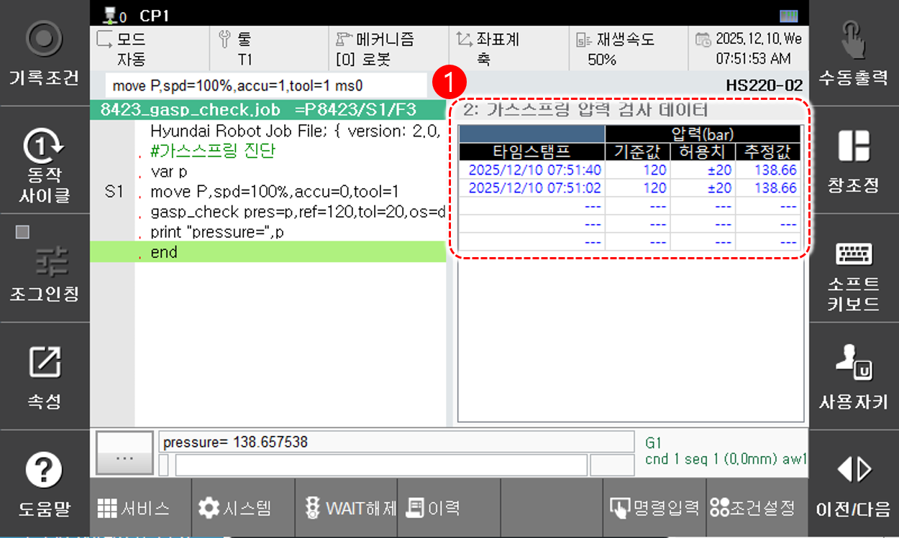

# 6.4.2.2 가스스프링 압력 검사 모니터링

아래 버튼에서 **[가스스프링 검사]** 를 터치하면 가스스프링 압력 검사 데이터 창이 나타납니다.

<table>
  <thead>
    <tr>
      <th style="text-align:left">번호</th>
      <th style="text-align:left">설명</th>
    </tr>
  </thead>
  <tbody>
    <tr>
      <td style="text-align:left">
        
      </td>
      <td style="text-align:left">
        
최근 5개의 가스스프링 압력 검사 결과를 표시합니다.

        <ul>
          <li><strong>[타임스탬프]</strong>: 가스스프링 검사를 수행한 시각을 표시합니다.</li>
          <li><strong>[압력]</strong>: 기준압력과 허용치, 추정된 압력을 표시합니다. </li>
        </ul>
      </td>
    </tr>
  </tbody>
</table>


* 가스스프링이 장착된 로봇에서만 지원되는 기능입니다.
* 가스스프링 검사 기능에 대한 자세한 내용은 "${cont_model} 제어기 기능설명서 - 로봇언어 HRScript" 의 [10.1.7 gasp_check문](https://hrbook-hrc.web.app/#/view/doc-hrscript/ko/10-etc/1-proc/7-gasp_check?cont_model=${cont_model}) 항목을 참조하십시오. 

