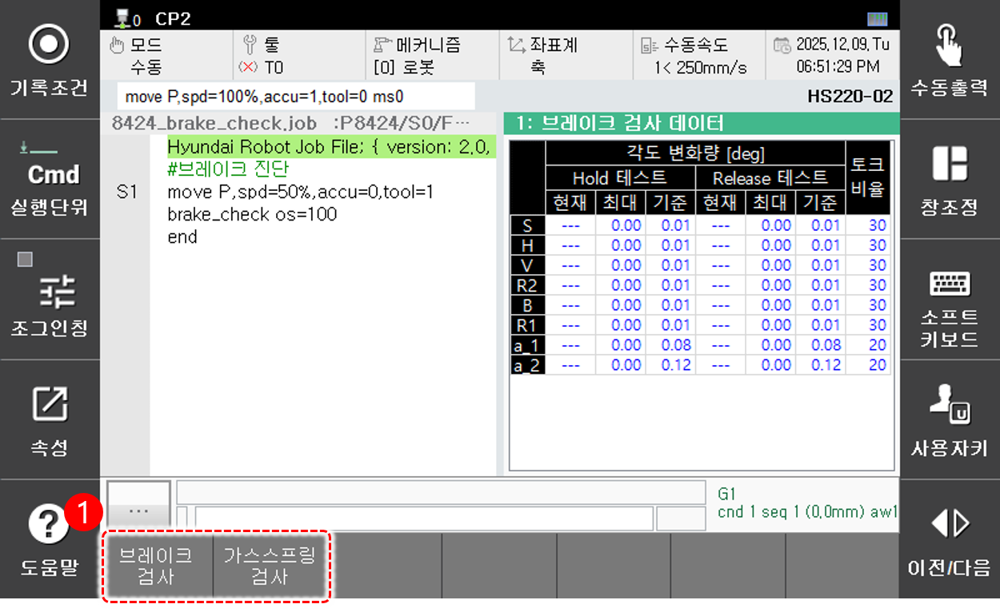

# 6.4.2 시스템 진단

패널 선택창에서 **[시스템 진단]** 을 터치하십시오. 최초 실행 시 브레이크 검사 데이터 창이 나타납니다.

<table>
  <thead>
    <tr>
      <th style="text-align:left">번호</th>
      <th style="text-align:left">설명</th>
    </tr>
  </thead>
  <tbody>
    <tr>
      <td style="text-align:left">
        
      </td>
      <td style="text-align:left">
        
<strong>[시스템 진단]</strong> 패널을 클릭한 상태에서 아래 버튼을 클릭하여 다른 검사 항목으로 전환할 수 있습니다.

        <ul>
          <li><strong>[브레이크 검사]</strong>: 브레이크 검사 데이터 화면으로 전환합니다.</li>
          <li><strong>[가스스프링 검사]</strong>: 가스스프링 검사 데이터 화면으로 전환합니다.</li>
        </ul>
      </td>
    </tr>
  </tbody>
</table>

