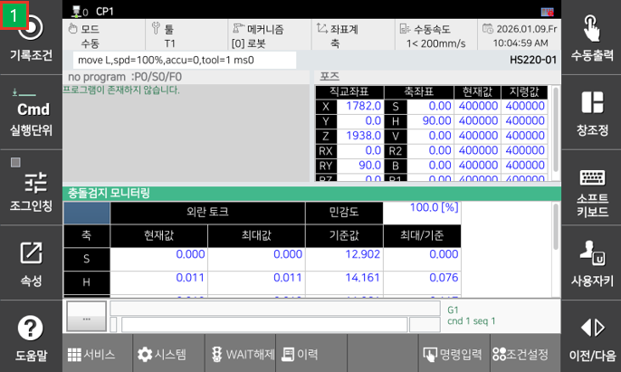
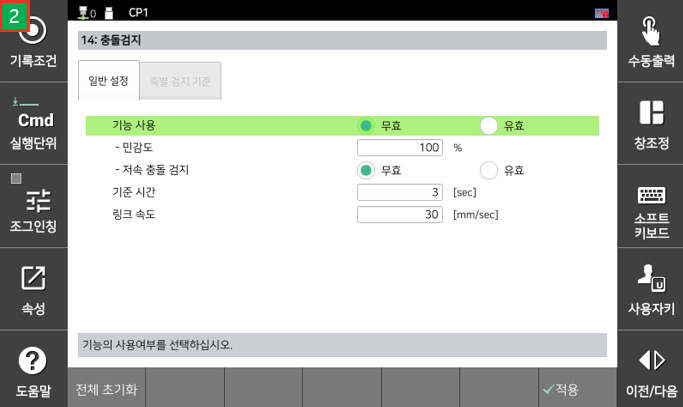

# 6.5.2 충돌검지 모니터링
 
 
 

 - [민감도] : 비율 값으로 높을 수록 민감하게 충돌을 검지 (0: 무효) [0~200]
 - [시스템>3:로봇 파라미터>14:충돌검지] 일반 설정 탭에서 [민감도] 값을 설정 할 수 있다. 
 - [외란 토크]-[현재값] : 현재 추정되는 외력 토크 [Nm]
 - [외란 토크]-[최대값] : 추정되는 외력 토크 중 최대값 [Nm]
 - [기준값] : 충돌이라 판단하는 토크 임계값 [Nm]
 - [최대/기준] : [최대값]값과 [기준값]값의 비율로서, 1 이상이 되면 해당 축에 충돌이 있다고 판단

