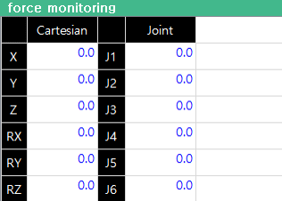

# 6.5.28 힘제어 모니터링
 

## 설명 
* 힘 제어 기능이 활성화 된 상황에서 [외력] 데이터를 모니터링
* 힘 제어 기능 : fctrl, softxyz 및 softjoint 명령어 

## 파라미터 

 - [cartesian] : 직교 좌표 외력 힘/토크 추정값   
    - fctrl 기능 사용시 : 로봇 좌표계 기준 힘과 토크값 표시
    - softxyz 기능 사용시 : 로봇 좌표계 기준 힘과 토크값 표시
    - softjoint 기능 사용시 : 표시하지 않음
 - [joint] : 축 좌표 기준 외력 토크 추정값 
    - fctrl 기능 사용시 : 표시하지 않음
    - softxyz 기능 사용시 : 표시하지 않음
    - softjoint 기능 사용시 : 토크값 표시  
