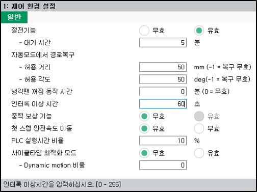

# 7.3.1 제어 환경 설정

제어기의 각종 조건을 설정하여 필요한 작업을 수행합니다.

1.	`2: 제어 파라미터 - 1: 제어 환경 설정` 메뉴를 터치하십시오.

2.	제어기의 제어 환경 조건을 설정한 후 `[확인]` 버튼을 터치하십시오.

* \[절전기능\]: 절전 기능의 사용 여부와 대기 시간을 설정합니다.

  절전 기능을 사용 설정하면, 자동 모드에서 로봇이 기동 대기, 입력 신호 대기 등의 장시간 동안 운전 정지 상태에 있는 경우 대기 시간이 경과하면 모터의 전원 공급을 차단하여 소비 전력을 절약합니다. 로봇에 운전 명령이 입력되면 자동적으로 절전 기능이 해제되어 모터에 전원을 공급하고 로봇이 동작합니다.


절전 기능이 활성화/비활성화되는 과정에서 지연 요소가 발생할 수 있습니다. 로봇의 속도를 예상하여 작업하는 경우에는 절전 기능을 무효로 설정하여 작업하십시오.


* \[자동모드에서 경로복구\]: 자동 모드에서 경로 복구 시의 허용 거리와 허용 각도를 설정합니다.

   경로 복구 시 거리 및 각도가 설정된 허용 범위 이상인 경우 에러를 검출합니다. 허용 거리를 -1로 설정하면 경로를 복구하지 않습니다.

* \[냉각팬 꺼짐 동작 시간\]: 

  로봇이 가동중인 상태에서는 회생저항에 의해 제어기 내부의 온도가 상승하며, 이 온도 상승을 방지하기 위하여 냉각팬이 동작되어야 합니다. 

  로봇이 비가동중인 상태에서는 제어기 내부의 온도는 더 이상 상승하지 않으며 따라서 이때는 냉각팬이 동작할 이유는 없습니다. 오히려 냉각팬이 동작하면 팬 수명의 단축, 소음 발생 및 소비 전력의 증가등의 역효과만 있습니다.

  로봇이 가동중인 상태(모터 ON)가 되면 즉시 냉각팬이 동작하여야 하며, 로봇이 비가동중인 상태(모터 OFF, 절전 동작)가 되면 일정 시간이 경과된 후 냉각팬을 동작하지 않습니다. 만약 즉시 냉각팬이 동작하지 않는다면 회생저항의 잠열에 의해 제어기 내부의 온도가 상승합니다. 

  냉각팬 껴짐/꺼짐 동작의 제어를 위한 신호 출력은 [시스템/제어 파라미터/입출력 신호 설정/출력 신호 할당] 메뉴의 "냉각팬 제어" 항목에서 설정하며 이 출력 신호로 냉각팬 전원 제어를 위한 회로가 구성되어야 합니다.

  "냉각팬 꺼짐 동작 시간"이 0으로 설정되었거나 "냉각팬 제어" 출력 신호가 -1로 설정된 경우에는 냉각팬이 항상 켜진 상태로 동작합니다. 

* \[인터록 이상 시간\]: 

  입력신호의 최대 대기시간을 설정하는 기능입니다.  
  재생 중에 입력신호 대기상태의 시간이 규정된 시간을 초과하면 인터록 이상신호를 출력합니다. 이 규정된 시간이 인터록 이상시간입니다.
  
  인터록 이상신호는 [시스템/제어 파라미터/입출력 신호 설정/출력 신호 할당] 메뉴의 "인터록 이상"에 할당되어 있는 신호입니다. 

* \[중력 보상 기능\]: 

  중력 보상기능은 로봇의 설정된 툴 부하에 따라 발생하는 처짐량을 예측해서 보상 함으로써 보다 정확한 위치 정확도를 기대할 수 있습니다.

  다만 툴 부하정보를 변경하는 경우 예상 처짐량이 달라 지게 되므로 기존과 다른 위치로 이동 하게 됩니다. 또한, 중력 보상 기능 적용 중에는 엔코더 값으로 기록된 스텝으로는 이동할 수 없습니다.


[시스템 > 6: 자동 캘리브레이션 > 9: 로봇과 툴 캘리브레이션]에서 강성을 포함하는 캘리브레이션을 한 경우, 중력 보상 기능을 유효로 할 수 있습니다.


* \[첫 스텝 안전속도 이동\]: 

  로봇 기동시 첫 스텝을 안전 속도로 제한하여 이동할지 현재 설정된 속도로 이동할지 설정합니다. 
  * 유효: 안전 속도로 제한하여 이동합니다.
  * 무효: 현재 설정된 속도로 이동합니다.

  로봇은 안전을 위해서 기동시 첫 스텝을 안전속도로 제한하여 이동하는것이 기본입니다. 단지 실링이나 도장같은 특수한 작업은 이에 의한 품질 문제가 발생할 수 있기 때문에 이런 경우에 한해서 제한적으로 무효로 사용하십시오. 

* \[PLC 실행시간 비율\]: 

  내장 PLC를 사용할 때 제어기 내부에서 PLC 실행 시간을 조절할 수 있습니다. 제어기는 내부적으로 5ms 마다 PLC 래더 프로그램을 실행하는데 PLC 실행을 어느 정도 할당할지 설정하십시오. 이 비율이 커질수록 PLC 프로그램의 스캔 타임을 단축할 수 있으나 너무 크면 CPU 실행시간이 부족하게 되어 태스크 실행시간 초과 에러가 발생할 수 있습니다. 
   

* \[사이클타임 최적화 모드 (Cycle Time Optimization Mode)
\]

  자동 재생 시 로봇의 스텝 이동 시간을 줄여 생산성을 향상시키는 기능입니다.
  * 유효
    - 로봇의 가감속 곡선 및 최고 속도를 동적으로 조정하여 더 빠르게 이동합니다.
    - 동적 가감속 조정이 적용됩니다. (Dynamic Motion 적용)

  * 무효
    - 기존에 설정된 고정 가감속 및 속도 조건으로 이동됩니다.
    - 일반 모드로 동작됩니다. (기존 Motion Profile 유지)

  * Dynamic Motion 비율 설정 (`0 ~ 100`)
    - `0` : 사용하지 않습니다. (정적 이동)
    - `0 ~ 1` : 동적 모션 적용 강도 조정할 수 있습니다.
    - 값이 클수록 더 적극적인 속도 최적화가 적용됩니다.


사이클타임이 중요한 공정(예: 반복적 픽앤플레이스)에서는 높은 Dynamic 비율을 적용하면 생산성 향상에 도움됩니다.



과감한 가감속 및 최고속 사용으로 과토크 에러 및 진동 발생 가능이 존재합니다.


