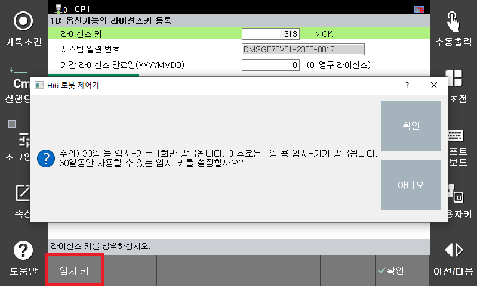
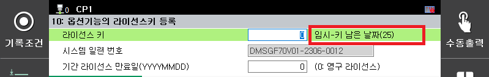

# 7.3.10.5 임시-키 발급

* 임시-키는 [F]키를 눌러 발급 받을 수 있습니다.

  

* 정상적으로 발급된 경우에는 다음 화면과 같이 사용할 수 있는 잔여일이 표시됩니다.

  

* 주의) 잔여일이 0인 경우에는 옵션기능을 더 이상 사용할 수 없으며, 이후에는 임시-키가 1일 사용으로 발급됩니다. 옵션기능 때문에 생산라인이 정지될 수 있으므로 반드시 잔여일이 0이 되기 전에 당사로 연락하여 정식 라이선스키를 발급 받으시기 바랍니다. 

