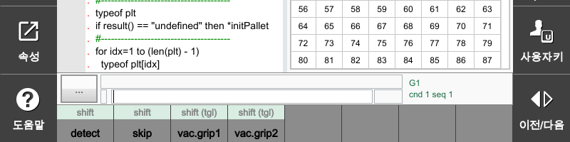

# 7.3.2.8 키 신호 출력

`키 신호 출력`은 원하는 변수를 F버튼에 할당하여, 버튼 조작으로 해당 변수의 값에 1이나 0을 대입할 수 있는 기능입니다. 주로, 출력 변수를 할당한 F버튼 조작으로 I/O 출력 신호를 켜거나 끄는데 사용합니다. (일반 변수, alias, 출력변수 등 모든 종류의 변수를 지정할 수 있습니다.)

1. `[F2: 시스템] - 2: 제어 파라미터 - 2: 입출력 신호 설정 - 5: 키 신호 출력` 메뉴를 선택하여, 설정화면을 여십시오.
2. 버튼에 표시할 기능 이름과 옵션을 설정한 후 `[F7: 확인]` 버튼을 터치하십시오.

* `제목` : 버튼에 표시할 이름
* `on-변수` : 변수명을 지정하면 버튼을 켜는 순간 해당 변수에 1이 대입됩니다.
* `off-변수` : 변수명을 지정하면 버튼을 끄는 순간 해당 변수에 1이 대입됩니다.
* 토글 :
  + 체크 함 : 버튼이 누를 때마다 ON/OFF 토글 동작을 합니다.
  + 체크 안 함 : 버튼이 누를 때 ON되고, 뗄 때 OFF됩니다.
* `자동 모드 시 허용` :
  + 체크 함 : 자동 모드 중에도 이 기능이 동작합니다.
  + 체크 안 함 : 자동 모드 중에는 이 기능이 동작하지 않습니다.
* `자동 모드 시 OFF` : 자동 모드로 전환하는 순간 이 기능에 설정한 변수들이 모두 OFF됩니다.


`on-변수`, `off-변수`에는 가령 3.5라고 입력하고 `[ENTER]`를 누르면 fb3.do5가 입력되고, 5라고 입력하고 `[ENTER]`를 누르면 do5가 입력됩니다.
혹은 하단의 F버튼 [fb], [do], [so] 을 사용하여 입력해도 됩니다.


3. `키 신호 출력` 버튼을 열고 `SHIFT` 키와 함께 등록한 F키를 터치하여 설정값이 제대로 적용되는지 확인하십시오.


${cont_model} 티치 펜던트의 사용자키 영역에서도 동일한 설정화면에 진입할 수 있습니다. 자세한 내용은 "[2.7.2.1 키 신호 출력 기능 영역](../../../2-operation/7-user-key/2-button-registration/1-key-signal-output.md)"를 참조하십시오.


