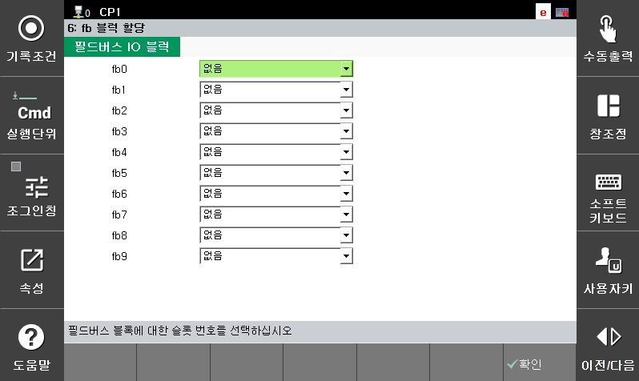

# 7.3.2.9 FB 블록 할당

제어기의 범용 입출력 신호를 사용하는 방법을 설정합니다. 

1.	`2: 제어 파라미터 - 2: 입출력 신호 설정 - 6: FB 블록 할당` 메뉴를 터치하십시오.

2.	선택된 FB 주소의 DIO 블록을 연결 설정한 후 `[확인]` 버튼을 터치하십시오.

    

 연결 가능한 옵션은 아래와 같습니다.
* [PCI 슬롯 1]
* [PCI 슬롯 2]
* [PCI 슬롯 3]
* [EtherNet/IP 어댑터]
* [이더켓 IO]
* [EtherNet/IP 스캐너]
* [사용자 DIO]
