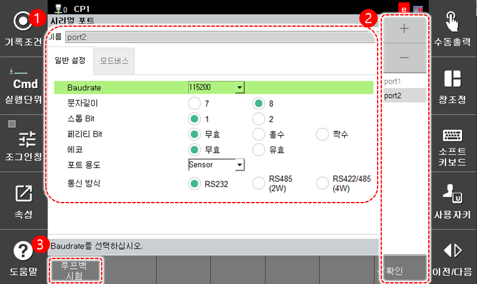

# 7.3.3 시리얼 포트

시리얼 포트 통신에 필요한 정보를 설정합니다.

1. `2: 제어 파라미터 - 3: 시리얼 포트` 메뉴를 터치하십시오.
2. 시리얼 포트별 파라미터를 설정하십시오.

<table>
  <thead>
    <tr>
      <th style="text-align:left">번호</th>
      <th style="text-align:left">설명</th>
    </tr>
  </thead>
  <tbody>
    <tr>
      <td style="text-align:left">
        
      </td>
      <td style="text-align:left">시리얼 포트 목록에서
        선택한 포트의 상세 정보입니다.
        포트 이름과 파라미터
        값을 설정할 수 있습니다.</td>
    </tr>
    <tr>
      <td style="text-align:left">
        
      </td>
      <td style="text-align:left">
        <ul>
          <li><strong>시리얼 포트 목록</strong>:
            포트 이름을 선택하면
            상세 정보를 확인 및 편집할
            수 있습니다.</li>
          <li><strong>[확인]</strong>: 변경 내용을 저장합니다.</li>
          <li><strong>[+]/[-]</strong>: 새로운 시리얼 포트를
            추가하거나 시리얼 포트를
            삭제합니다.</li>
        </ul>
      </td>
    </tr>
    <tr>
      <td style="text-align:left">
        
      </td>
      <td style="text-align:left">
        루프백 시험을 수행합니다. 시리얼 포트의 RX와 TX를 연결한 상태에서 통신이 정상인지 확인합니다.
      </td>
    </tr>
  </tbody>
</table>


다음의 정보를 참고하여 시리얼 포트의 용도를 설정하십시오.

* Sensor: 비전 센서와 접속하여 시프트 데이터 수신
* LVS: 용접선 추종을 위한 레이저 비전 센서 연결
* MODBUS: ${cont_model} 제어기의 MODBUS 슬레이브 기능 사용


