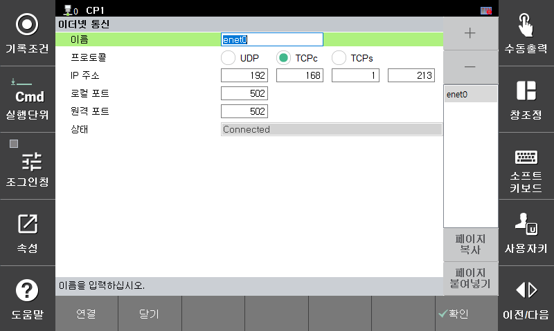

# 7.3.9.2.4 이더넷 통신 설정

이더넷 통신을 수행하기 이전에 먼저 이더넷 통신 객체를 생성하고 설정해야 합니다.  
이더넷 객체는 최대 5개까지 생성하여 사용할 수 있으며 또한 현재 통신 상태에 대한 모니터링이 가능합니다.  

현재는 HRScript에서 모드버스 마스터 동작을 수행하기 위해 사용됩니다. 모드버스 통신 기능에 대한 자세한 내용은 별도의 "[${cont_model} 제어기 기능설명서 - 모드버스](https://hrbook-hrc.web.app/#/view/doc-modbus/ko/README?cont_model=${cont_model})"를 참조하십시오.  

[닫기] 버튼으로 해당 이더넷 객체의 소켓을 강제로 닫을 수 있으며 [연결] 버튼으로 통신 연결을 수행할 수 있습니다.  
제어기 부팅시에는 설정된 이더넷 객체로 통신 연결을 자동으로 수행합니다.  

*   **이름**

    이더넷 통신 객체의 이름입니다. 각각의 이름은 반드시 "enet0" ~ "enet4"로 설정되어야 합니다.

*   **프로토콜**

    통신 프로토콜을 선택합니다. 

*   **IP 주소**

    통신 대상에 사용된 IP 주소를 설정합니다. 

*   **로컬 포트**

    지역 포트 번호를 설정합니다.

*   **원격 포트**

    원격 포트 번호를 설정합니다.

*   **상태**

    통신 연결 상태를 표시합니다. 
