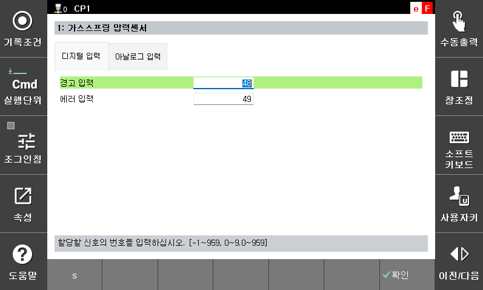
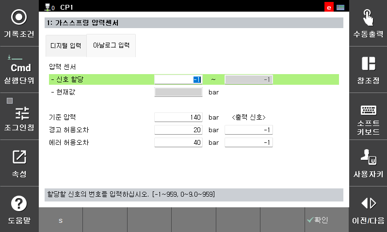

# 7.4.13.1 가스스프링 압력센서

가스스프링 압력센서 기능은 가스스프링을 사용하고 여기에 당사에서 지정한 압력센서(PN2570)가 부착된 로봇에서 디지털 입력에 의해 경고나 에러를 발생한다던지 또는 아날로그 입력에 의해 상시 압력센서의 값을 읽어 가스스프링의 압력 이상을 검출하기 위해 사용합니다.    

[디지털 입력]  

<table>
  <thead>
    <tr>
      <th style="text-align:left">항목</th>
      <th style="text-align:left">설명</th>
    </tr>
  </thead>
  <tbody>
    <tr>
      <td style="text-align:left">
        경고 입력
      </td>
      <td style="text-align:left">
        경고를 입력받을 신호의 번호를 설정합니다. 압력센서에서는 계측된 압력이 설정한 허용오차를 벗어났을 때 경고 출력을 할 수 있습니다. 제어기에서는 설정된 신호가 on될때 W21020를 발생합니다.
      </td>
    </tr>
    <tr>
      <td style="text-align:left"> 
        에러 입력
      </td>
      <td style="text-align:left">
        에러를 입력받을 신호의 번호를 설정합니다. 압력센서에서는 계측된 압력이 설정한 허용오차를 벗어났을 때 에러 출력을 할 수 있습니다. 제어기에서는 설정된 신호가 on될때 E21020를 발생합니다.
      </td>
    </tr>
  </tbody>
</table>

 

[아날로그 입력]  

<table>
  <thead>
    <tr>
      <th style="text-align:left">항목</th>
      <th style="text-align:left">설명</th>
    </tr>
  </thead>
  <tbody>
    <tr>
      <td style="text-align:left">
        신호 할당
      </td>
      <td style="text-align:left">
        압력센서의 값이 입력되는 디지털 신호를 설정 합니다.
      </td>
    </tr>
    <tr>
      <td style="text-align:left"> 
        현재값
      </td>
      <td style="text-align:left">
        압력센서에서 계측되는 압력값이 표시됩니다.
      </td>
    </tr>
    <tr>
      <td style="text-align:left"> 
        기준압력
      </td>
      <td style="text-align:left">
        가스스프링에 주입한 기준 압력을 설정 합니다. 
      </td>
    </tr>
    <tr>
      <td style="text-align:left"> 
        경고 허용오차 및 출력 신호
      </td>
      <td style="text-align:left">
        계측된 압력이 기준 압력에서 설정한 허용오차를 뺀 값보다 작을 때 W21018을 발생합니다.  
        출력 신호가 설정되어 있으면 해당 신호 출력을 on 합니다. 
      </td>
    </tr>
    <tr>
      <td style="text-align:left"> 
        에러 허용오차 및 출력 신호
      </td>
      <td style="text-align:left">
        계측된 압력이 기준 압력에서 설정한 허용오차를 뺀 값보다 작을 때 E21018를 발생합니다.  
        출력 신호가 설정되어 있으면 해당 신호 출력을 on 합니다.  
      </td>
    </tr>
  </tbody>
</table>

 


* 본 기능은 V70.00.00 이상의 버전에서 지원합니다.    


