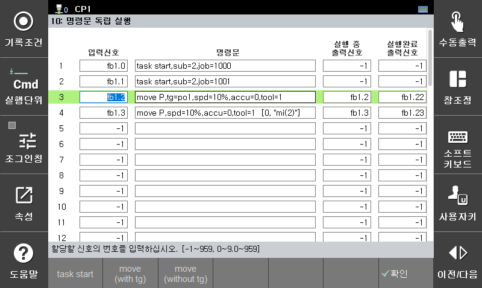

# 7.5.10 명령문 독립 실행

설정된 입력 신호가 OFF에서 ON되었을 때 해당하는 명령문을 작업 프로그램과 별도로 수행하는 기능입니다.  
사용하지 않는 서브태스크를 이용해서 해당 명령문을 실행하게 되는데 보통은 서브태스크 1이 사용됩니다.  
멀티태스킹에 대한 자세한 내용은 "[${cont_model} 제어기 기능 설명서 - 멀티태스킹](https://hrbook-hrc.web.app/#/view/doc-multi-task/ko/README?cont_model=${cont_model})"를 참조하십시오.

  * 입력 신호: 제어기에 입력되는 신호를 설정합니다.
  * 명령문: 
    * 입력 신호가 OFF에서 ON될때 실행할 명령문을 기록합니다. 
    * 일반적으로 정치서보건의 건서치 및 팁드레싱 작업을 위해서 task start가 사용되며 포지셔너 독립운전을 위해서는 move가 사용됩니다. 
    * task start 사용시 이 명령을 실행하는데 서브태스크 1이 사용되므로 sub는 2이상으로 지정하거나 0으로 지정하십시오. (0=자동할당)
  * 실행 중 출력신호: 
    * 해당 명령문의 실행을 시작하면 ON되고 실행이 완료되면 OFF됩니다. 
    * 명령문이 move가 아니면 실행시간이 매우 짧기때문에 의미가 없습니다.
  * 실행완료 출력신호: 
    * 해당 명령문의 실행을 시작하면 OFF되고 실행이 완료되면 ON됩니다. 
    * 명령문이 move가 아니면 실행시간이 매우 짧기 때문에 의미가 없습니다.


* 자동모드의 모터ON 상태에서만 실행이 가능합니다.
* move문을 실행하는 경우는 해당 축이 메인 태스크에서 사용하지 않도록 메커니즘으로 분리하거나 axisctrl off로 축제어 상태를 무효화 하여야 합니다.

