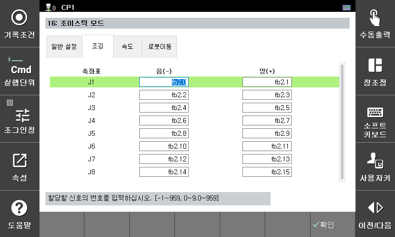

# 7.5.16.1 조깅(입력신호)

신호 입력에 의한 로봇 조깅을 위해서는 각각의 방향키에 해당하는 입력 신호를 설정합니다.  
해당 입력 신호가 ON상태의 구간에서 해당축이 지정된 방향으로 이동합니다.  

좌표계에 입력 신호를 설정한 경우에는 해당 입력 신호가 ON이 되면 이에 매칭되는 좌표계가 선택이 됩니다.  

매커너즘 번호에 해당하는 입력 신호를 상태에 따라서 매커니즘의 변경이 가능합니다.  

