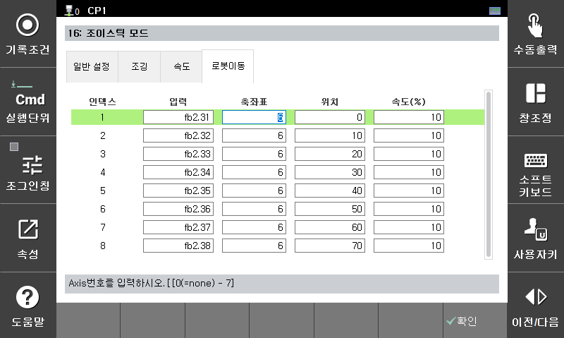

# 7.5.16.4 로봇이동

신호 입력에 의해 지정된 로봇의 축을 지정된 속도로 지정된 위치까지 이동하는 기능입니다.  
하기의 그림에서 fb2.di34 신호가 ON되면 로봇 6축의 위치가 30도가 되도록 10%의 속도로 로봇이 이동합니다.  

로봇 2축 이상을 동시에 이동하려면 입력신호를 동일하게 설정하면 됩니다. 이때 이동속도는 이 중에서 가장 선두에 기록된 설정값이 적용됩니다.  

