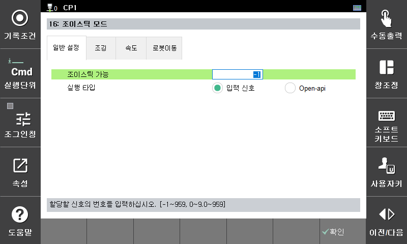

# 7.5.16 조이스틱 모드

조이스틱과 같은 외부 장치로 로봇의 조작을 수행하기 위한 기능입니다. 

* 조이스틱 가능  
   조이스틱 모드에 해당하는 기능들을 수행하기 위해서는 입력 신호의 설정이 반드시 필요하며 또한 ON 상태가 되어야 합니다. 

* 실행 타입  
   조깅 동작을 설정된 신호의 입력 상태로 수행할지 Open-api의 입력 상태로 수행할지 선택합니다.  
   조깅 동작은 T/P의 수동모드에서 조작하는 조그키 동작과 완전히 동일합니다. 


* 자동 모드의 모터온 상태에서만 동작합니다.

