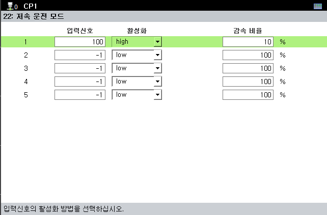

# 7.5.22 저속 운전 모드

입력 신호(di)가 OFF에서 ON되었을 때 재생 속도가 설정한 감속 비율로 줄어듭니다.  
move 문 로봇 속도는 기존 속도값에 자동모드 재생속도와 감속 비율이 반영되어 적용됩니다.  

  * 입력 신호: 제어기에 입력되는 신호를 설정합니다.
  * 활성화: 
    * High : 신호가 ON일 때 감속 적용, 신호 OFF일 때 감속 해제
    * Low : 신호가 Off 일 때 감속 적용, 신호 ON일 때 감속 해제
  * 감속 비율:  
    * 재생 속도 기준 감속할 비율을 결정합니다.
    * 저속 운전 모드 입력 신호가 들어왔을 때 로봇 속도는 자동모드 재생속도에 감속 비율을 곱한 값이 반영됩니다.


* 수동모드에서는 감속 비율이 적용되지 않습니다.



* 입력 신호의 상태에 알맞는 활성화 조건을 선택하여 구동하십시오.
* 재생 중 강제로 I/O 신호가 들어오는 경우에도 저속모드가 적용됩니다.

