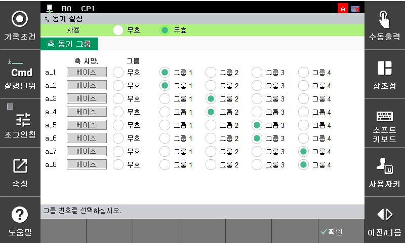

# 7.6.7 축 동기 기능

부가축 2개를 항상 동일한 위치로 움직이도록 하나의 동기 쌍으로 묶는 기능입니다.

축 동기를 유효로 설정하면 지정된 부가축들 간의 위치를 소프트웨어적으로 항상 동기하여 움직이게 됩니다. 그러므로 동기하고자 하는 부가축들을 물리적으로 정렬한 상태에서 축 원점 설정을 통해 소프트웨어적으로 동일한 위치로 인식할 수 있도록 해야 합니다. 또한 동기하고자 하는 축들의 물리적인 이동 방향이 같은 방향이 되도록 설정되어야 합니다.

축 동기는 최대 4쌍의 부가축들 간의 위치 동기를 지원합니다. 동일한 그룹으로 부가축 2개를 선택하면 하나의 동기 쌍으로 묶이게 됩니다.

현재 설정된 축 동기 쌍을 변경하는 방법은 다음과 같습니다.

1. R321 동기 조그 기능이 활성화 되어 있다면 전부 `무효`로 변경합니다.

2. 엔지니어 모드(R314) 선택 후 시스템>>5.초기화>>8.축 동기 설정 으로 진입합니다.

3. 축 동기 기능을 활성화하는 경우 `사용`을 `무효`에서 `유효`로 변경합니다.

4. 하나의 축으로 간주하고자 하는 2개의 부가축을 같은 그룹으로 지정합니다.  

5. 축 동기 그룹 지정을 마쳤으면 `[확인]` 버튼을 누릅니다.


* 축 동기 설정 완료 후 Motor On 시 그룹 쌍이 중간값으로 정렬하므로 정렬 완료될 때까지 대기합니다.
* 축 동기 기능이 설정된 이후 각각의 축을 개별적으로 움직일 수 없으며 조그키도 하나의 축으로 할당 되게 됩니다.
* 조그 이외 Job 파일을 실행할 때도 해당 기능이 반영됩니다.
* 축 동기 그룹 쌍은 재부팅 되어도 초기화되지 않습니다.
* `사용`이 `무효` 로 설정 되어 있으면 축 동기 기능이 활성화되지 않습니다.
* 축 동기 그룹 쌍의 직교 좌표계 Pose 값은 실제 로봇의 Pose 상황과 일치합니다.
* 비상정지 또는 서보 에러 등, 기타 요인에 의해 동기축들의 위치에 오차가 발생하는 경우 Motor On 시점에 2개 축의 중간 지점으로 이동해 다시 정렬하게 됩니다.



* 반드시 모터 사양과 부가축 파라미터 설정값이 동기화에 맞는 상태(축 사양, 구성, 속도, 가속시간 동일)인지 확인하고 사용하십시오.
* 축 동기 기능을 사용하지 않는 경우 사용여부를 `무효`로 설정하고 그룹 쌍도 `무효`로 초기화하십시오.
* 동기 조그 기능과 혼용해서 사용하지 않도록 주의하십시오.
* Job 파일의 step pose 값이 축 동기가 고려되어 구현되었는지 확인하십시오.
* 축 동기 기능 구동 중 변경할 시 직교좌표계가 변한다는 점 유의하여 사용하십시오.

