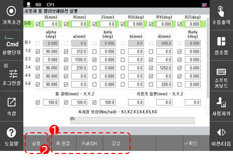
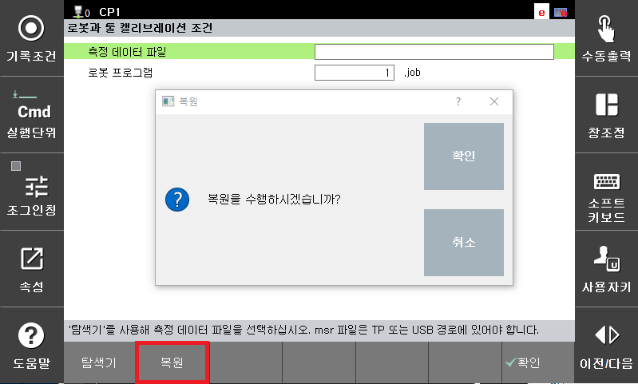

# 7.7.6 로봇과 툴 캘리브레이션

로봇과 툴 캘리브레이션 기능은 3차원 측정기로 로봇의 툴끝 위치를 측정할 수 있는 환경에서 사용합니다.

1.	로봇의 툴 끝에 측정할 위치를 선정한 후 로봇의 위치와 자세를 다양하게 움직이면서 15 점 이상의 위치를 측정하고 로봇 위치를 프로그램으로 기록하십시오. 
 필요한 측정 포인트의 갯수는 캘리브레이션 대상 파라미터의 종류가 많을수록 증가 합니다. 
  일반적으로는 측정 데이터의 갯수가 많을수록 보다 정확한 캘리브레이션이 가능 합니다. 

2.	측정한 로봇의 위치 데이터\(측정점 데이터\)를 X, Y, Z 형식으로 정리하여 파일\(형식: ASCII, 확장자: MSR\)을 생성하십시오.

3.	위치 데이터 파일을 이동식 저장 장치에 저장한 후 이동식 저장 장치를 티치 펜던트에 연결하십시오. ${cont_model} 티치 펜던트 화면의 상태 표시줄에 \[USB\] 아이콘\(\)이 나타납니다.

4.	`6: 자동 캘리브레이션 - 9: 로봇과 툴 캘리브레이션` 메뉴를 터치하십시오.

5.	\[탐색기\] 버튼을 터치하여 위치 데이터 파일을 선택한 후 측정에 사용한 로봇 프로그램을 설정하십시오.

6.	`[확인]` 버튼를 터치하십시오. 로봇과 툴 캘리브레이션 실행 화면으로 전환됩니다.

7.	로봇과 툴 캘리브레이션 실행 화면에서  에서 캘리브레이션 대상 파라미터의 종류를 선택 한 후  \[실행\] 버튼을 터치하십시오. 
 잠시동안 파라미터를 최적화 한 후 캘리브레이션 결과가 나타납니다. 
 기본적으로 축 원점 파라미터 및 툴 길이에 대한 파라미터가 선택되어 있습니다. 필요에 따라 링크간 길이 및 축 각도와  
 같은 오차들을 포함해서 캘리브레이션 하는 경우 \[Full-DH\] 파라미터를 선택 합니다.  
 각 조인트들의 강성을 포함해서 캘리브레이션 하는 경우 \[강성\] 옵션을 선택 합니다. 
 단, Full-DH파라미터 캘리브레이션 및 강성을 포함하는 경우, 보다 정확한 측정 장치로 30 포인트 이상의 위치 측정이 필요합니다. 
 부정확 한 측정기를 통해 상대적으로 오차가 큰 측정 데이터를 통해 캘리브레이션 하는 경우, 
  때때로 매우 부정확한 결과를 얻을 수 있으니 주의 하십시오.

8.	캘리브레이션 결과를 확인한 후 `[확인]` 버튼을 터치하십시오. 캘리브레이션 결과값이 축 원점 및 툴 정수에 자동으로 적용됩니다.  
강성을 포함해서 캘리브레이션 한 경우 `시스템``제어 파라미터``제어 환경 설정`에서  
중력보상 기능을 유효로 할 수 있습니다.  중력 보상기능을 유효로 하는 경우 로봇은 설정된 툴 부하에 따라  
발생하는 처짐량을 예측해서 보상 함으로써 보다 정확한 위치 정확도를 기대할 수 있습니다. 
다만 툴 부하정보를 변경하는 경우 예상 처짐량이 달라 지게 되므로 기존과 다른 위치로 이동 하게 됩니다. 
또한 중력 보상 기능 적용 중에는 엔코더 값으로 기록된 스텝으로는 이동할 수 없으니 참고 하십시오. 

9.	`3: 로봇 파라미터 - 1: 툴 데이터` 메뉴를 터치하여 로봇 캘리브레이션 실행 결과를 확인할 수 있습니다.


캘리브레이션 파라미터의 2 ~ 5축\(H, V, R2, B축\)의 축 원점과 툴 길이 X, Y, Z 값은 기본으로 선택되어 있습니다. 툴만 캘리브레이션하려면 각 축의 값을 선택 해제한 후 실행하십시오.


 

## 캘리브레이션 데이터 복원

로봇과 툴 캘리브레이션을 수행하면 /ata0:2/lib/hi6/backup/의 경로에 calibration.json 파일로 캘리브레이션 데이터를 별도로 보관합니다.  
시스템 초기화등의 조작으로 인해 캘리브레이션 데이터가 사라졌을 때 보관된 파일을 이용해서 복원이 가능합니다. (단, 시리얼엔코더 리셋을 수행하여 엔코더 데이터가 초기화된 경우에는 복원이 불가합니다.)

1. /ata0:2/lib/hi6/backup/의 경로에 alibration.json 파일이 존재하는 경우에 "복원" 버튼이 활성화 됩니다.
2. 복원을 수행한 후 전원을 재투입하면 이전에 수행한 로봇과 툴 캘리브리이션 데이터로 적용됩니다.

