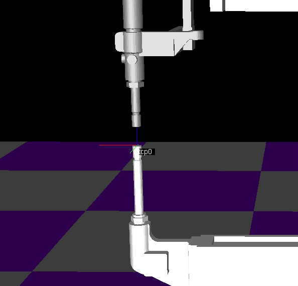
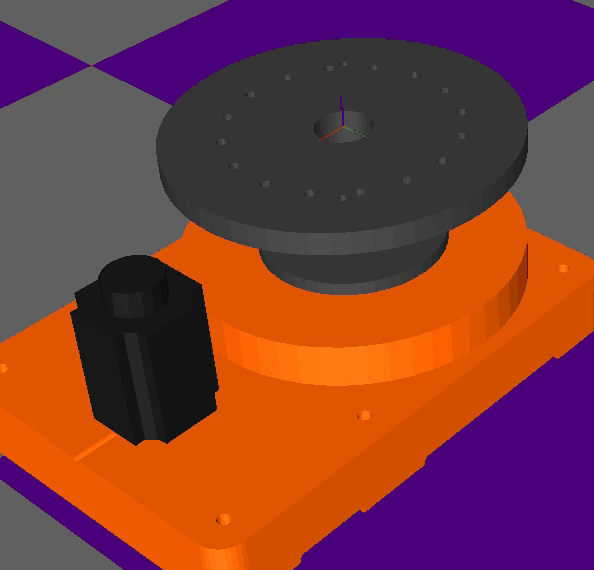
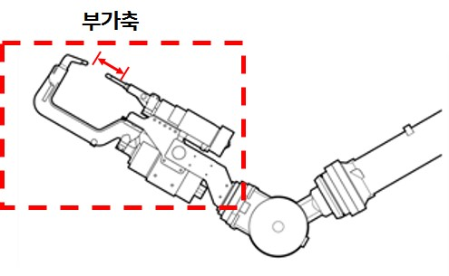
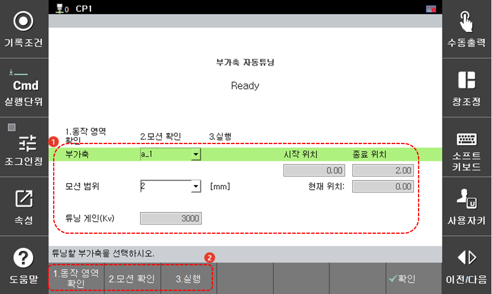

# 7.7.7 부가축 자동튜닝

* V60.28-00 버전부터 사용 가능합니다.

 

### (1) 개요

사용자가 설정한 범위 내에서 부가축을 움직이면서 최적의 게인을 찾습니다. 이 기능은 부가축에 적절한 게인이 설정되어 있지 않아 소음이나 제어 성능이 나쁜 경우에 사용됩니다.

|  |  |
|---|---|
| 직동축 모션 | 회전축 모션 |
<!--  -->

### (2) 튜닝 상세 설명

  **튜닝 전 설정**

**[부가축]**: 튜닝할 부가축을 선택합니다.

**[모션 범위]**: 부가축 움직임 범위(직동 축: 2, 5, 10[mm] / 회전 축: 2, 5, 10[deg])를 설정합니다. 부가축의 위치를 조그를 통해 조정하여, 적절한 부가축 모션 범위를 설정합니다. 더 큰 모션일수록, 튜닝이 잘 됩니다(현재 주어진 최대범위 10mm(or 10deg) 보다 더 큰 모션은 추가적인 개발이 필요합니다).

* 시작 위치: 부가축 자동튜닝이 시작 될 때, 시작 위치입니다.
* 종료 위치: 부가축 자동튜닝이 시작 될 때, 끝 위치입니다.
* 현재 위치: 현재 부가축 위치를 나타냅니다.

**[튜닝 게인(Kv)]**: 튜닝되는 파라미터 값입니다.

 

 **튜닝 프로세스(동작 영역 확인 > 모션 확인 > 실행)**

A. 동작 영역 확인

* 낮은 속도로 설정된 모션 범위를 움직입니다. 부가축 모션 범위에 문제가 있는 경우, 정지 버튼을 누르고 모션 범위를 재설정하세요.

B. 모션 확인

* 빠른 속도로 설정된 모션 범위를 움직이며 초기 게인 값을 확인합니다.

C. 실행

* 튜닝되는 부가축은 시작위치와 종료위치 안에서 움직이면서 적절한 게인을 찾는 모션을 진행하게 됩니다.
* 튜닝 중에 부가축에서 잠깐의 큰 소음(발진 게인 값을 찾는 과정)이 발생할 수 있습니다.
* 튜닝이 끝나면 튜닝 파라미터 Kv의 튜닝 전, 후에 대한 게인 값이 보여집니다. `[확인]`을 누르면 게인 변경 여부를 묻는 창이 뜨게 되고, 확인을 누를 시 튜닝된 게인으로 설정됩니다. 확인을 누르지 않을 경우, 기존 게인 값이 유지가 됩니다.



소음은 데이터로 분석이 어려운 부분으로, 튜닝 담당자가 직접 소음을 들으며 튜닝하는 것 만큼 섬세하게 튜닝되기 어렵습니다. 수동으로 게인을 튜닝하는 경우, Kv 게인 조정을 통해 수동 튜닝을 진행할 수 있습니다.

* 통상 Kv 게인이 너무 낮은 경우, 트래킹 성능이 저하되며 진동이 발생할 수 있습니다.
* 반대로 Kv 게인이 너무 높은 경우, 모터에서 고주파 소음이 발생하게 됩니다.

자동으로 튜닝된 게인이 소음이 날 경우, `[F2:시스템] - 3. 로봇 파라미터 - 33. 서보 파라미터 - 1. 서보 루프 게인` 메뉴로 진입하여 Kv 값을 낮춰가며(Kv 값이 바뀌면, 다른 게인 값들은 자동 계산되어 바뀜) 고주파 소음이 안나는 지점을 찾아야 합니다.

그럼에도 지속적인 소음이 발생한다면, 당사로 문의 주십시오.


