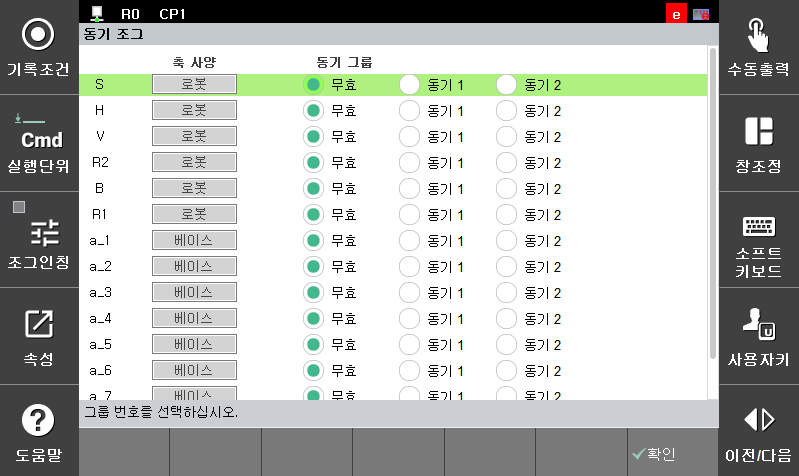

# 8.17 R321 동기 조그

임의의 축들을 하나의 동기 그룹으로 묶고 조그키 하나로 조그하는 기능입니다. 

축 동기 조그 기능을 사용하는 방법은 아래와 같습니다.

1. 하나의 키로 움직이고자 하는 축들을 같은 동기 그룹으로 설정하고 `[확인]`  버튼을 누릅니다.
2. 조그키를 이용해서 축 동기 조그를 사용합니다.
3. 축 동기 조그 기능의 사용을 마치면 동기 그룹을 모두 무효로 설정합니다.


* 해당 기능은 조그할 때만 유효합니다. 자동 모드에서는 동기 기능이 적용되지 않습니다.
* 동기 조그 쌍은 재부팅이 되어도 초기화되지 않습니다.
* 동기 조그 쌍의 직교 좌표계 Pose 값은 실제 로봇의 Pose 상황과 항상 일치하지는 않습니다.(단순한 조그 기능)


